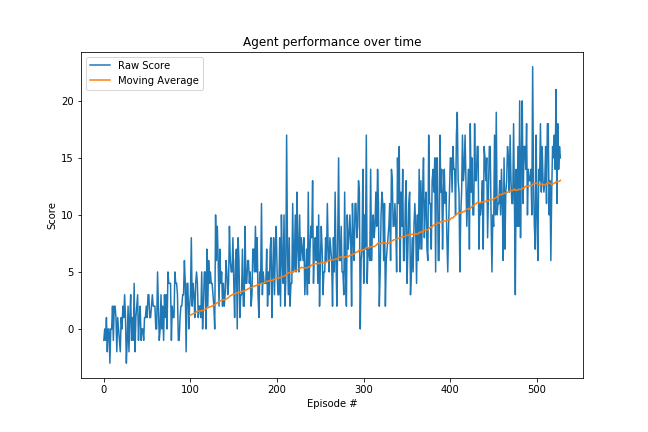

# Report
The following report contains details regarding the algorithm used to solve the environment, information about the agent performance, and ideas for follow-on work.

---

## Learning algorithm
The learning algorithm that was used to solve the environment was the Deep Q Network. At a high level, the agent interacts with the environment, collects experiences, and adds them to the replay buffer. Every so often, the agent chooses to learn from it's experiences by sampling some set of the replay buffer and updating the Q Network weights. The agent then uses this updated model to continue interacting with the environment, retraining, interacting, etc. until the agent solves the environment.

The model architecture for the Q network is a fully-connected Dense neural network, where the input layer size is 37 (corresponding to the state space size), the two Dense hidden layers are of size 64, and the output layer size is 4 (corresponding to the action space size). The network uses ReLU non-linear activation functions for the hidden layers to capture the non-linear nature of the environment.

The hyperparameters used during training are as follows:
* Replay Buffer size: 100000 experiences
* Batch size: 64
* Gamma (discount factor): 0.99
* Tau (soft update weight for target Q network): 0.001
* Learning rate: 0.0005
* Update every (how often to retrain the target network): 4 steps

## Plot of rewards

The plot below shows the agent's learning progress over time.

From above we can see that agent learning improves steadily over time until we reach an average reward of +13 for the last 100 episodes at episode 513.

## Ideas for future work

Some concrete ideas for improving the agent's performance are:

* Automatic hyperparameter tuning: I went through a few different iterations of hyperparameter tuning manually. However, this is not feasible at the scale needed to truly identify the optimal hyperparameters, so setting up a framework to truly perform large-scale automated hyperparameter tuning would allow us to find the best configuration to solve the environment.

* Decrease epsilone faster: The progress of learning was fairly consistent over time. One possible option to increase the rate of learning would be to decay epsilon faster than the 0.995 multiplying factor that was used to get the results above. The hypothesis is that all else being equal, we would take fewer random actions faster and rely on learned behavior in fewer episodes.

* Prioritized replay sampling: The sampling used was uniformly random from the replay buffer, which treats all experiences equally. We know that this isn't always the case, as certain experiences lead to better learning performance. Adding prioritized replay sampling should lead to faster agent learning.

* Changing the Q Network architecture: The neural network architecture used was fairly simple; two layers of 64 neurons. It's possible that adding more layers or increasing the size of each layer would increase the agent's capacity to learn, which might take longer to train initially, but with the correct learning parameters, could lead to solving the environment faster.